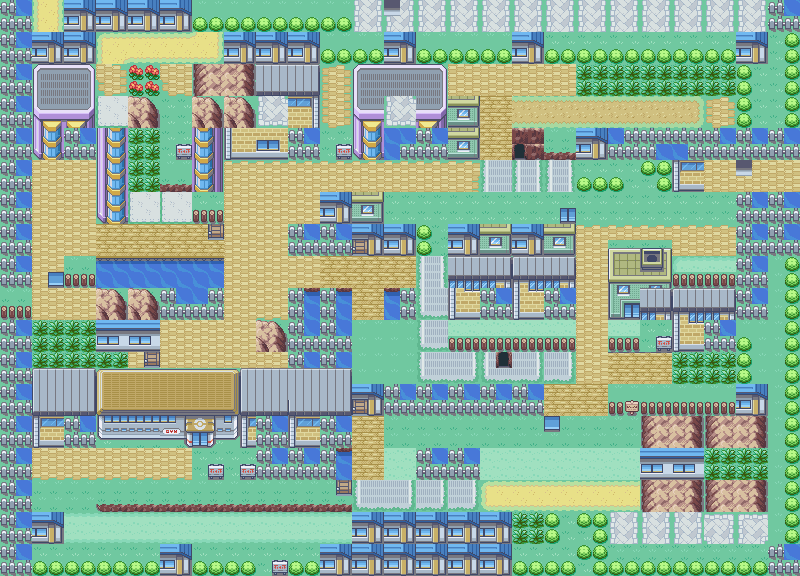
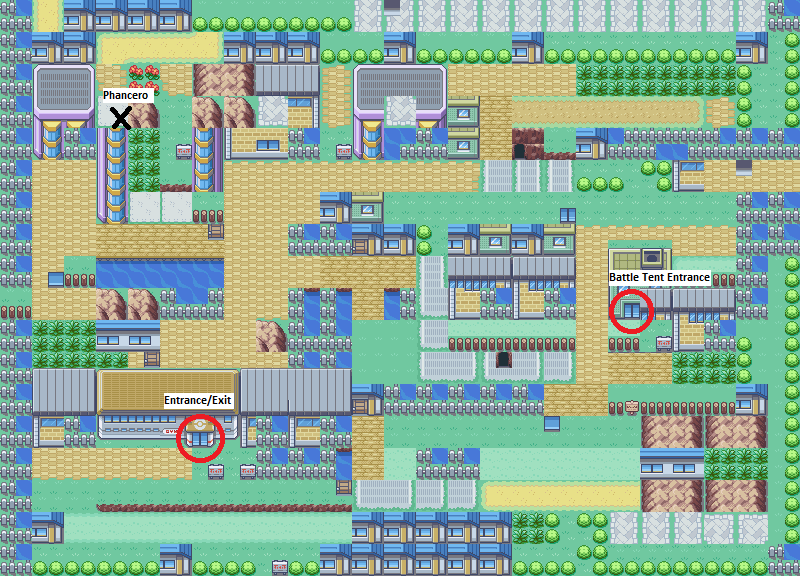
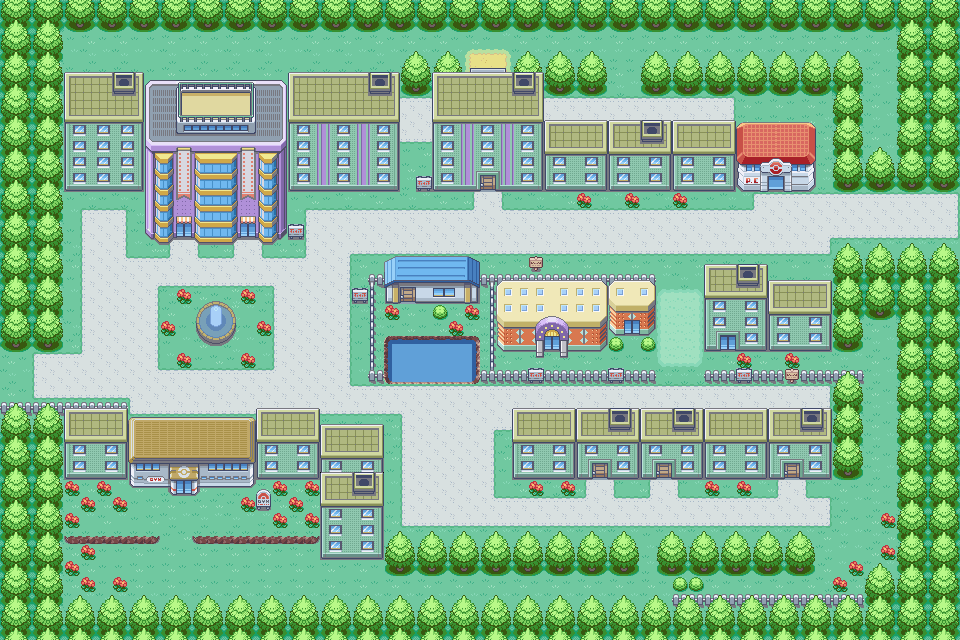
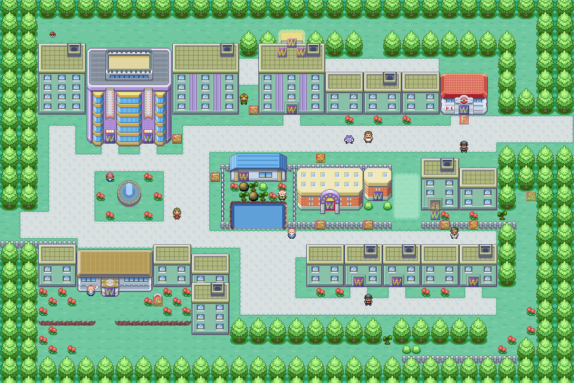

# Glitch City development notes

* [Design Notes](#design-notes)
* [Images](#images)
* [Phancero](#phancero)

---

# Design Notes

## Glitch City

* Glitch City dimensions, blocks, warps and movement permissions are identical to Red
* The trees grow back as soon as a step is taken (may not be possible to replicate)

### Phancero Encounter

* Encounter with Phancero, lv. 70  
* If the player kills Phancero or runs away, they are warped back the Celadon City to emerge from the Battle Tent  

### Warps

* If the player leaves Glitch City (through the door of the Gym), they are warped back the Celadon City to emerge from the Battle Tent
* There is a warp to a Glitch Battle Tent interor
* There are random doors placed throughout the map that warp the player to the same spot - this will force a change between Red and FireRed

### Connections

* The map is connected to itself to create an infinite map
* Top and bottom connections have no offsets
* Left offset: 7
* Right offset: -7

## Celadon City

* A door has been added to the house across the water
* The man has moved
* There is a strength and cut puzzle in front of the door
* The Battle Tent is present but is not accessible
* When a player walks to the door and presses A, text reads:
    ```
    It's locked up tight.
    The building looks abandoned...
    ```
* There is a sign outside the Battle Tent which reads:
    ```
    BATTLE TENT
    ...
    The sign is scratched and faded.
    It's impossible to read further...
    ```

---

# Images

## Glitch City

Blocks:



Events:


Annotated blocks:



## Celadon City

Blocks:



Events:



---

# Phancero

## Stats

* HP: 178 / Attack: 137 / Defense: 57 / Speed: 128 / Special Attack: 85 / Special Defense: 65
* Slow Rate, Base EXP: 216
* Ghost/Flying
* Cacophony
* Catch Rate: 3

## HMs

* Fly
* Surf

## TMs

* Swords Dance
* Toxic
* Double-Edge
* Counter
* Seismic Toss
* Thunder
* Earthquake
* Psychic
* Double Team
* Sky Attack
* Rest
* Thunder Wave
* Tri Attack
* Substitute

## Learnset

* Lv. 1: Pound
* Lv. 4: Teleport
* Lv. 7: Gust
* Lv. 10: Lick
* Lv. 15: Water Gun
* Lv. 20: Agility
* Lv. 25: Wing Attack
* Lv. 30: Acid Armor
* Lv. 35: Leech Seed
* Lv. 40: Night Shade
* Lv. 50: Sky Attack
* Lv. 60: Water Gun
* Lv. 70: Wrap
* Lv. 80: Drill Peck
* Lv. 90: Mirror Move
* Lv. 95: Tri Attack
* Lv. 100: Hi Jump Kick

## Pokédex Entry

* Type: Glitchbird
* Color: Purple
* Height: 1.5 m
* Weight: 46.8 kg

```
A lost bird that creates illusions to
protect itself. Has only been seen
during unusual circumstances.
```
